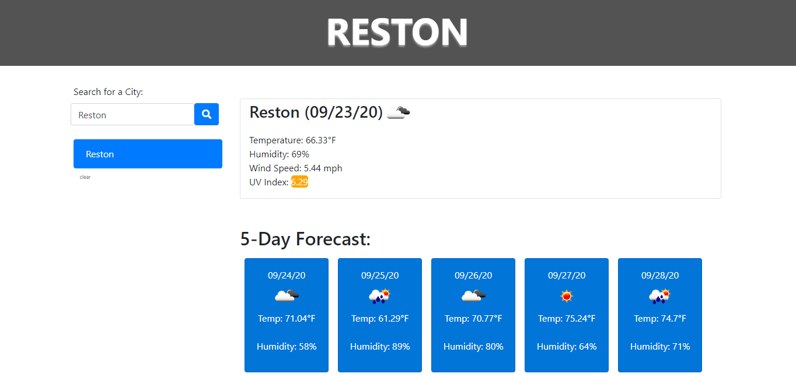

<h1 align="center">Weather Dashboard</h1>
Created a dashboard that uses the [OpenWeather API](https://openweathermap.org/api) to retrieve weather data for cities that are searched for by user. Uses `localStorage` to store any cities that have been searched for prior and allows user to call them up quickly.  

**Live application deployed at: https://razaqabdul8.github.io/homework_6**  

Image of deployed application:

  